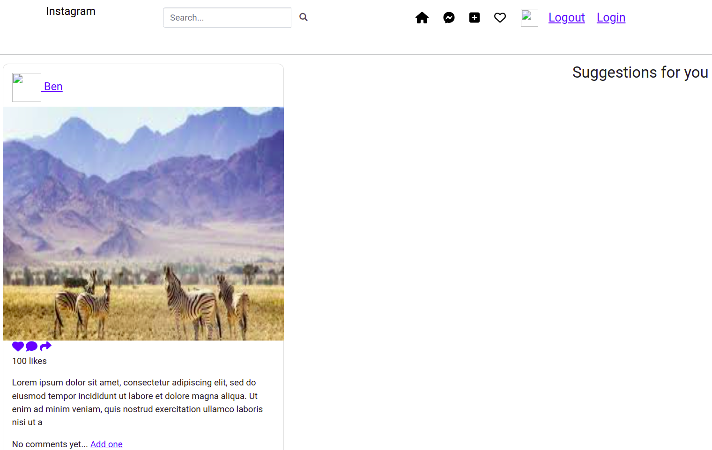
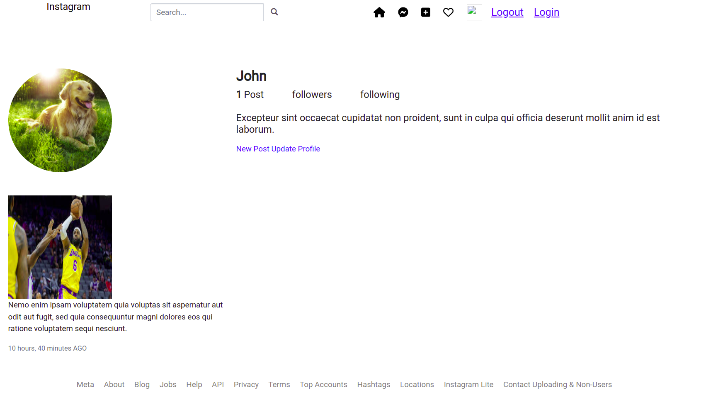
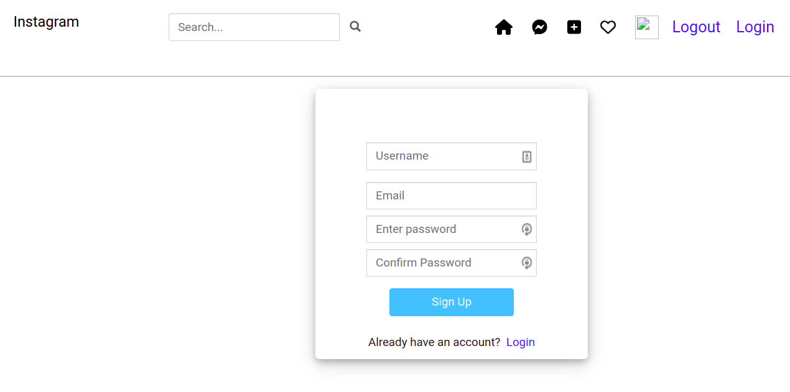
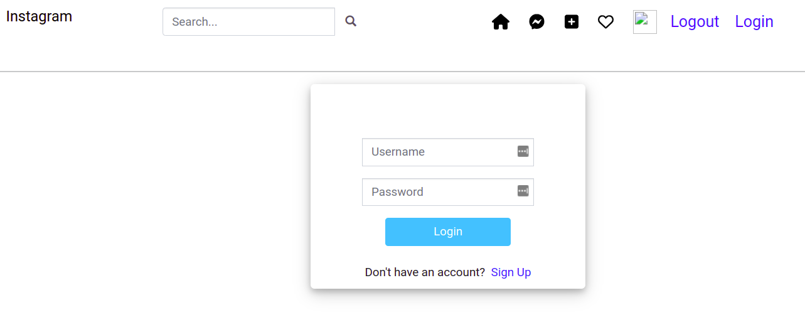

# Instaclone

Instaclone is a website clone of the popular photo application, Instagram. Users can create an account, sign into the application, and post photos for others to see. Users can also follow other accounts, comment on and like their photos. 

# By **Robert Kirui**

June 6, 2022.

# Description

Instaclone is largely a visual platform. Its primary purpose is to enable users to share images with their audience. To do this, users must create an account (sign up) and use the account to post images to which other users can comment and like. Authenticated users can also follow other accounts, view, comment, and like their images. 

# User Stories
- As a user of the application I should be able to create an account and sign in to the application to start using it.
- As a user, I should be able to upload my pictures to the application.
- As a user, I should be able to see my profile with all my pictures.
- As a user, I should be able to follow other users and see their pictures on my timeline.
- As a user, I should be able to like a picture and leave a comment on it.

# Screenshots 
### home page

### user profile page

### sign-up and login pages
  

# Behaviour Driven Development (BDD) 
- Scenario 1: User wants to login to the application
  * GIVEN the user has accessed the application 
  * AND the user has an account created, then the user can enter the username and password to sign into the application. 

- Scenario 2: User wants to sign up on the application
  * GIVEN the user does not have an account created. 
  * WHEN the user clicks the 'sign up' button.
  * AND provides the username, email, and password.
  * THEN an account will be created for the user.  

- Scenario 3: User wants to create a post
  * GIVEN the user has signed in and is in the home page
  * WHEN the user clicks 'square plus' icon in the navbar
  * THEN a form for creating a new post appears, and the user can provide the details for the post and clicks the 'post' button to make a post.

- Scenario 4: User wants to view profile 
  * GIVEN the user has signed in and is in the home page
  * WHEN the user clicks the profile image on the far right of the navbar, and a drop-down appears with a profile tab.
  * THEN the user can click the profile tab to view his/her personal profile include past posts made.

- Scenario 5: User wants to leave a like on someone else's post
  * GIVEN the user has signed in.
  * WHEN the user sees an image post that he/she wants to like
  * THEN the user can click the 'heart' icon below it to leave a like (the heart icon changes color to red after a like).

- Scenario 6: User wants to leave a comment on someone else's post
  * GIVEN the user has signed in.
  * WHEN the user sees an image post that he/she wants to leave a comment on.
  * AND the user has clicked the comment icon below the image
  * THEN a comment box appears, and the user can type the comment on it.

# Setup/Installation

- Fork the project from this repo
- Run git clone https://github.com/Kirugik/instaclone.git to have the project files in your preferred directory on the local machine.
- Change directory into the specific folder containing the project files.
- Run 'pip install -r requirements.txt' to install the project dependencies.
- Run the project in the terminal using: 'python manage.py runserver'.

# Technologies Used

Python, Django, HTML, CSS, heroku

# License

- Licensed under the [MIT License] (LICENSE).

Copyright (c) 2022. **Robert Kirui**

